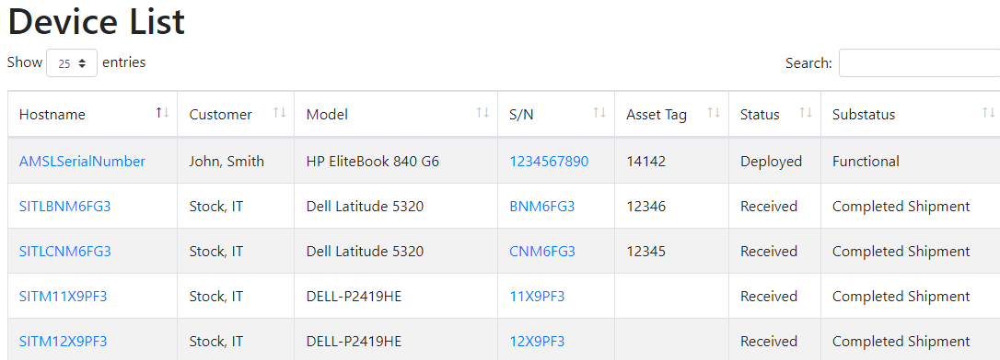
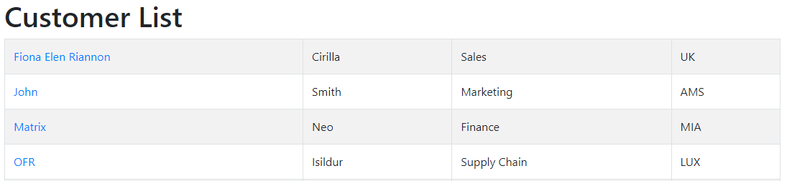
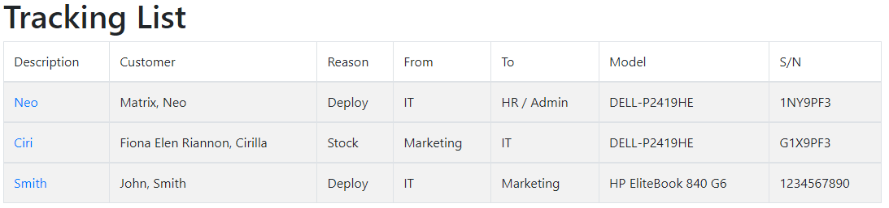

# IT Asset Management System (Django)
* If you manage a fleet of assets (Laptop, Desktop, Monitor) in an organization, you might have come across 
the challenge of tracking their status and who is using them. This Django application has been built with 
the aim of solving this issue.

## Features at a glance

This application will help you manage equipment assets
1. Add/Maintenance/Delete assets
2. Add/Maintenance/Delete Customer
3. Add/Maintenance/Delete models, types, location etc
4. Tracking assets (assigned to user and prints receipt document)<br>

> [WiKi](https://github.com/dalasidaho/asset_management/wiki)
***
### Front-End





### Back-End [interface](https://github.com/dalasidaho/asset_management/wiki/Backend-interfase "backend").


### Installation:
***
install python-3.9.5 <br>
(Win CMD) install django and extensions:
``` cmd
pip install django
pip install django-bootstrap4
pip install python-dateutil
pip install django-import-export
pip install django-qr-code
```

Configure app:
1. Choice folder for web app. For example: (C:\asset)
2. Create project:
- ``` cd C:\asset ``` (all other action do in this location) <br> 
- ``` pip install virtualenvwrapper-win ```
3. ``` django-admin startproject asset ```
4. ``` cd C:\asset\asset ```
5. Create app ``` python manage.py startapp catalog ```
6. Update settings.py:

```python
 INSTALLED_APPS = [
    'django.contrib.admin',
    ...
    'catalog.apps.CatalogConfig',
    'import_export',
    'bootstrap4',
    'qr_code',
]


IMPORT_EXPORT_USE_TRANSACTIONS = True
```
Time and Date settings in settings.py to set correct datetime in creation and modified fields:
```python
TIME_ZONE = 'UTC'

USE_I18N = True

USE_L10N = False
DATE_FORMAT = 'd-m-Y'
DATETIME_FORMAT = 'd-m-Y H:i'

USE_TZ = False


```

7. Update urls.py set:
```python
from django.contrib import admin
from django.urls import path, include
from django.views.generic import RedirectView

urlpatterns = [

    path('admin/', admin.site.urls),
    path('catalog/', include('catalog.urls', namespace='catalog')),
    path('', RedirectView.as_view(url='catalog', permanent=True)),

]
```

8. If you want to use stock db (db.sqlite3) go to next step
if you want use other DB, do next before run migrations
- install and configure MySql:
- setup SQL Workbench create DB and DB user
- install mysqlclient and config db connect
``` pip install mysqlclient ```
- update settings.py db
``` python

DATABASES = {
    'default': {
        #'ENGINE': 'django.db.backends.sqlite3',
        #'NAME': BASE_DIR / 'db.sqlite3',
        'ENGINE': 'django.db.backends.mysql',
        'NAME': 'set_dbname',
        'USER': 'set_db_user',
        'PASSWORD': 'set_db_user_password',
        'HOST': 'localhost',
    }
} 
```

9. Run Migrations (cmd)
```
python manage.py makemigrations
python manage.py migrate
```

10. Create superuser <br> (cmd)
``` python manage.py createsuperuser ``` <br>
Enter Admin name and password

11. Copy models, views, templates etc From Catalog to Catalog in your app folder<br>
12. Start and Check app (cmd)
- ``` python manage.py runserver ```<br>
try to open in browser <br> 
- ```http://127.0.0.1:8000```

***
